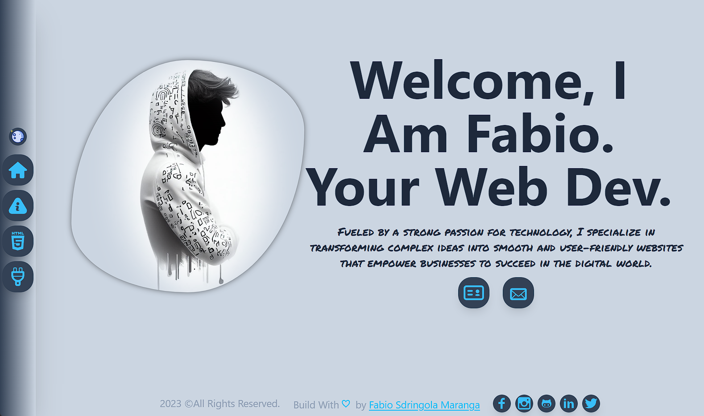

# My Personal Portfolio Website

Welcome to my personal portfolio website! This website showcases my projects, skills, and experiences as a web developer. It is built using React.js, Tailwind CSS, and utilizes animations made with Framer Motion to create a visually appealing and interactive experience.

## Live Demo

You can check out the live version of my portfolio website [here](https://fabiosdringola.pages.dev/).

## Features

- **Project Showcase:** Browse through a collection of my latest and most exciting web development projects. Each project includes a brief description, technologies used, and a link to view the live demo or GitHub repository.

- **Skills & Expertise:** Discover the various technologies, programming languages, and frameworks I specialize in. I have experience in front-end development, back-end development, and database management.

- **About Me:** Get to know me better! Learn about my background, education, and what motivates me as a web developer. I share my passion for creating user-friendly and visually stunning websites.

- **Contact:** Interested in collaborating on a project or want to say hello? Use the contact form on the website to get in touch with me. I'm always open to exciting opportunities!

## Technologies Used

- React.js: A popular JavaScript library for building user interfaces. It allows for efficient and modular development, making it ideal for creating single-page applications.

- Tailwind CSS: A utility-first CSS framework that streamlines styling and provides pre-designed components. It helps in keeping the CSS code concise and maintainable.

- Framer Motion: A powerful animation library for React that enables smooth and interactive animations. With Framer Motion, the website comes to life with delightful transitions and effects.

## Installation and Setup

1. Clone the repository to your local machine.
   git clone https://github.com/FabioSM46/my-portfolio-cli

2. Navigate to the project directory.

3. Install the dependencies using npm or yarn.
   npm i or yarn i

4. Run the development server.
   npm start or yarn start

5. Open your web browser and visit `http://localhost:3000` to view the website.

## Contributing

If you find any issues or have suggestions for improvement, feel free to open an issue or create a pull request. Contributions are always welcome!

## License

This project is licensed under the [MIT License](https://tlo.mit.edu/learn-about-intellectual-property/software-and-open-source-licensing/open-source-licensing).

## Credits

Special thanks to CodeBucks for providing helpful resources and tutorials that contributed to the development of this portfolio website.

---

Thank you for visiting my portfolio website! I hope you enjoy exploring my projects and learning more about my skills as a web developer. If you have any questions or feedback, don't hesitate to reach out. Happy browsing! 😊
